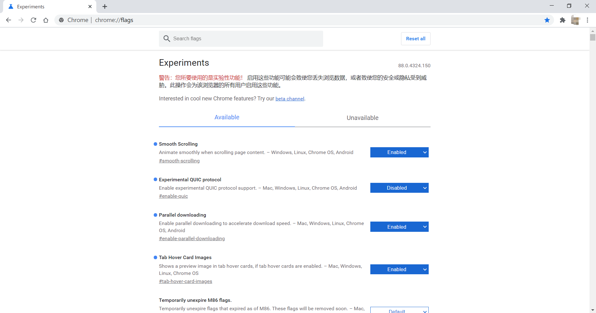
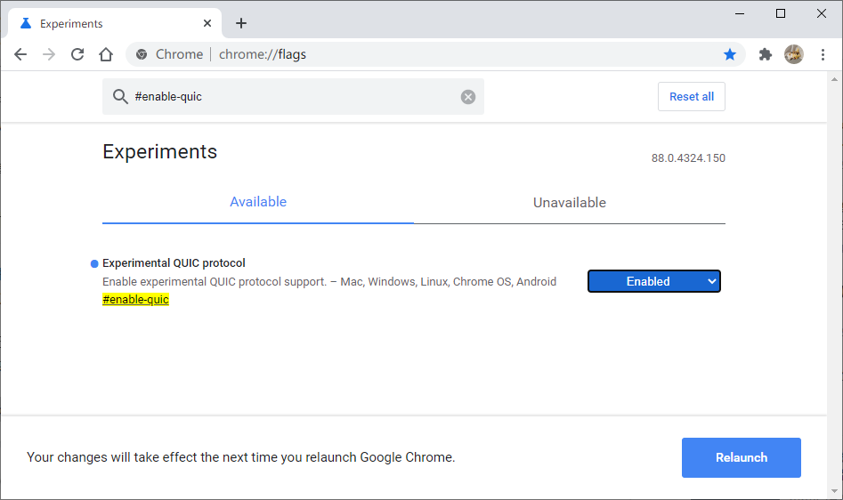
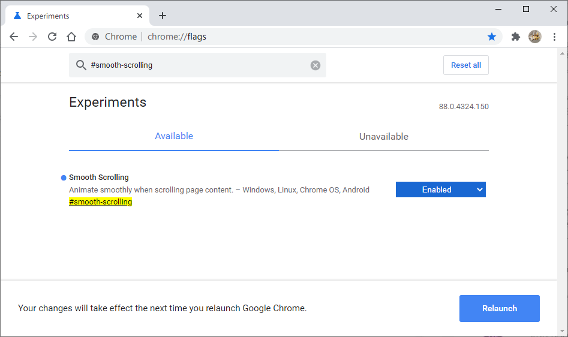
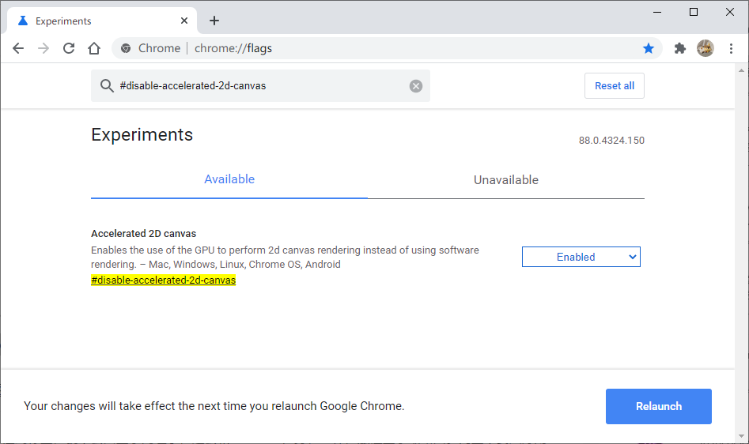
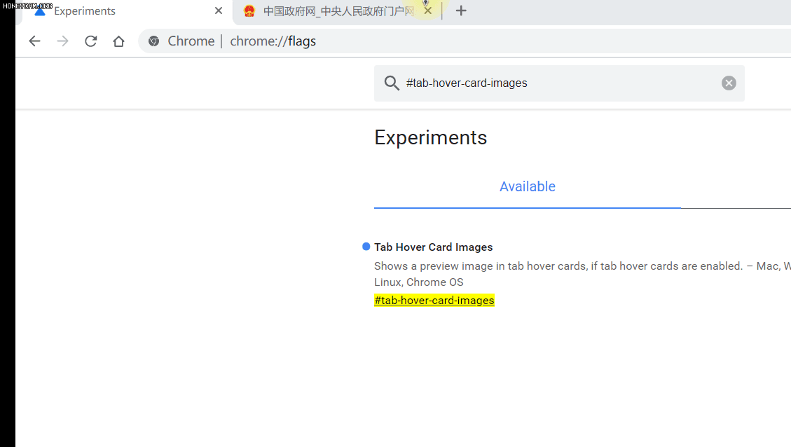
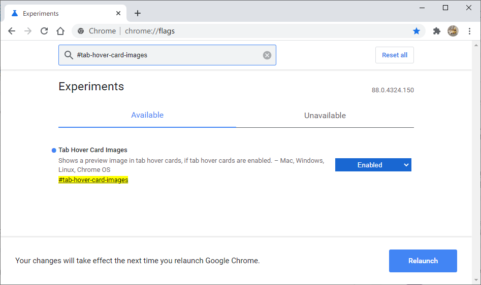
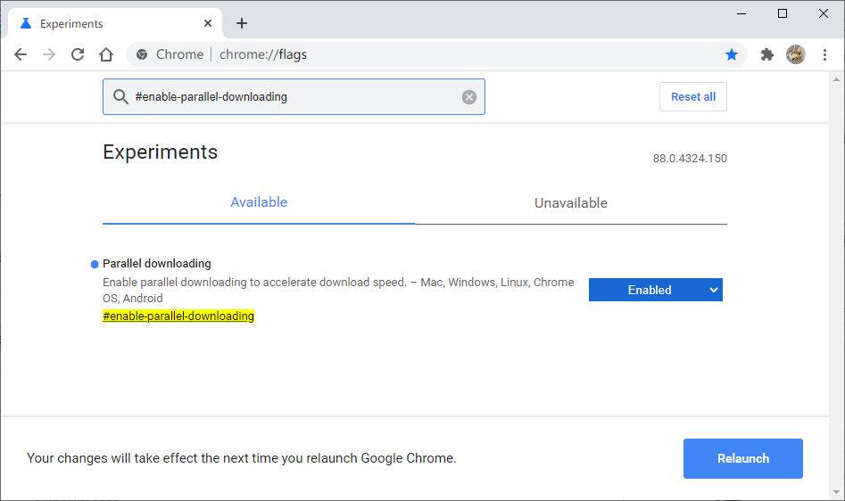

# Chrome实验室 —— 打开Chrome隐藏功能

谷歌浏览器和新版edge可以通过实验室打开隐藏功能。许多被研发而未被正式使用的新功能都集成在chrome实验室，可以人为打开。由于浏览器的版本不同，功能会有出入。

#### 打开方式：
- 谷歌浏览器在地址栏输入： **Chrome://flags/**
- 新版Edge在地址栏中输入：**Edge://flags/**

如上图所示，在这个页面中，有两个标签页，Available为可用功能，Unavaliable则为不可用功能。每一个选项都有 Disabled（禁用），default（默认，会随着浏览器更新而选择是否开启），Enabl（启用）。每次开启或者关闭，需要重启浏览器生效。

##### QUIC协议
> QUIC的主要特点包括，具有SPDY（SPDY是谷歌研制的提升HTTP速度的协议，是HTTP/2.0的基础）所有的优点；0-RTT连接；减少丢包；前向纠错，减少重传时延；自适应拥塞控制， 减少重新连接；相当于TLS加密。
搜索： **#enable-quic** 选择 **Enable**

#### 平滑滚动
> 你是否曾经注意到您的滚动停顿或它可能会变得迟钝？发生这种情况的原因可能很多，但是谷歌浏览器可以设置。
搜索：**#smooth-scrolling** 选择 **Enable**

#### 加速2D渲染
> 现在我们的显卡已经非常不错了，使用硬件渲染达到更快的速度。如果GPU在渲染方面比软件做得更好，此功能允许使用GPU渲染2D画布。
搜索：**#disable-accelerated-2d-canvas** 选择 **Enable**

#### 标签页略缩图
> 开启功能后，碰到标签，就不会只显示网址了，还会和Windows任务栏一样，触碰显示缩略图。简直不要太好用

搜索：**#tab-hover-card-images** 选择 **Enable**

#### 并行下载
> 为啥IDM下载速度那么快，是因为有很多个线程同时下载，实际上chrome也是支持的。开启后，Google就支持多线程下载了。像有的浏览器，还可以设置最大连接数，更给力。
搜索：**#enable-parallel-downloading** 选择 **Enable**

设置完这些功能后，点击Chrome底部的 Relaunch ，等待浏览器重启后，功能就生效啦！！！
