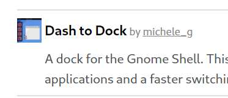
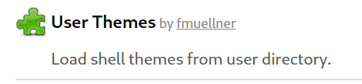
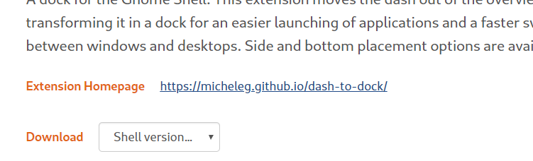
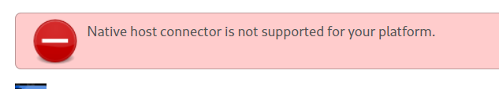
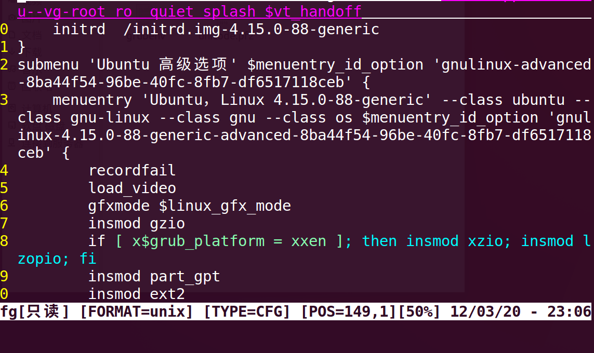

# Gnome3的美化详解

> Linux的图形用户界面（GUI）提供了直观的视觉操作环境，用户可通过鼠标、菜单等交互，常见桌面环境包括GNOME——以简洁设计、易用性和高度可定制性著称，是Fedora、Ubuntu等发行版的默认界面。GNOME基于GTK+工具包，支持扩展和主题定制，兼顾新手友好与高级用户需求。

## 本文针对的美化部分包括：
- 主题
- 图标
- 锁屏
- 开关机画面
- Gurb
- 插件
- 鼠标
- 终端及其配色方案

## 资源下载：
- 请先下载好资源再继续进行。下列两个网址的内容一样，请根据下载体验自行选择。
  - [超星直链](https://pan-yz.chaoxing.com/external/m/file/444967976524017664?name=gnome%E7%BE%8E%E5%8C%96%E5%8C%85.tar&appId=1000)
  - [百度网盘](https://pan.baidu.com/s/1E8csDwQbfDMSiccJUa41cQ?pwd=g1xf)
- 你也可以去gnome look自行下载（需要特殊方式上网（你懂的），不会就老老实实选择我提供的资源）

## 开始整活!
> 在这里我默认你用 Ubuntu ，若你不是用debian系的，所以一切apt有关的命令请自行换成适合你系统的

### Gnome插件：
1. 首先安装 gnome-tweak-tool：
~~~bash
sudo apt-get update
sudo apt-get install gnome-tweak-tool
sudo apt-get install chrome-gnome-shell  (火狐和谷歌浏览器都是用这个)
#如果还不行请再安装：
sudo apt-get install gnome-shell
~~~
2. 安装chrome插件GNOME Shell integration：
> 你可以直接再chrome商店里直接搜[GNOME Shell integration](https://chrome.google.com/webstore/detail/gnome-shell-integration/gphhapmejobijbbhgpjhcjognlahblep)。如果你进入不了谷歌商店，请到百度上搜索下载该插件文件，手动添加。如果硬是没辙，请看下一步的手动安装。这一步只是为了更方便。在这里，我也默认你用的是chrome，如果你使用Firefox，请去插件商店搜索GNOME Shell integration或尝试其他办法。
3. 下载Gnome插件
- 进入gnome插件市场(https://extensions.gnome.org/)或者直接点击GNOME Shell integration的图标，找到**dash to dock**并安装;
    
> 稍微等一会儿会有一个弹窗询问你是不是要安装这个插件，点击确定，然后再稍微等一会儿。（因为国外网站，网速慢，基本上也被墙了）
> 补充: 我记得ubuntu商店好像也有，可以去看一下🙈

- 建议还附带安装User Themes， 后面要用，当然我后面还会再提到。
    
> 🍖手动安装: 在插件安装界面点击 “Extension Homepage”右边的网址，进入该项目的github，然后就看GitHub上给的教程了。一般步骤都是克隆下源代码，然后再源代码目录进行编译make。你如果不想要让你的目录变得显得脏乱的话，那么你就得要实现进入~/.local/share/gnome-shell/extensions(针对当前用户)或者/usr/share/gnome-shell/extensions/(所有用户)再进行操作了，因为自动下载好的插件也在这两个目录下。建议初学者还是选择自动下载的方式。
> 

4. 按下 Alt 和 F2 键 ，再弹出的窗口里输入r回车。打开 gnome-tweak-tool，点击到插件那一栏，找到dash to dkch，选择打开功能，并设置自定义项（点击开关左边的小设置图标）。然后怎么设置就看你自己了，你可以把dock栏移动到底部，其他的自己去琢磨吧，这里就不限制大家的想法了。
> 🎬可能会出现的问题：
> 如图，出现这样的问题，那就说明你没有安装  chrome-gnome-shell。
> 

### 主题：
1. 请在gnome插件的网站下载好 User Themes ，在 tweak的插件选项卡下打开该插件。如果你按照我上面说的已经下载好了，那就不要下载了。
2. 将我给的资源解压了，把“主题包”解压后的文件夹放在  ~/.themes    或   /usr/share/themes  然后配合gnome-tweak-tool 选择新主题。

### 图标：
- 把在图标包的文件夹解压后，把图标主题的文件夹放入 ~/.icons 或者 /usr/share/icons。然后配合tweak进行更改。
> 注意：图标主题的文件夹里面应该包含有后缀为theme文件，一个压缩包里可能不止一个主题。其他的项目，像主题等都是同样的道理。

### 鼠标：
- 鼠标的操作也图标是一模一样的，目标文件夹也是一样，故同上。
- 鼠标应该不止gnomes可以用，大家可以在其他GUI下测试

### 登陆界面：
1. gnome的原登陆界面不是我喷，那是真滴丑。那我们就该改一改。
- 将bg-boat.jpg 复制到背景文件夹
~~~bash
cp ~/Downloads/bg-boot/bg-boat.jpg /usr/share/backgrounds/
~~~
- 将原先的ubuntu.css备份，以防万一
~~~bash
cp /usr/share/gnome-shell/theme/ubuntu.css /usr/share/gnome-shell/theme/ubuntu.bk
~~~
- 复制gb-boat的css到目标主题文件夹
~~~bash
cp ~/Downloads/bg-boot/ubuntu.css（这里要填该文件在你电脑上的实际路径） /usr/share/gnome-shell/theme/
~~~
- 重启电脑
~~~bash
reboot -f
~~~

### 开机画面：　　　　　　
1. 将解压后的文件夹移动到目录**/usr/share/plymouth/themes**
2. 将script后缀文件的内容修改为：
~~~js
[script]
ImageDir=/usr/share/plymouth/themes/（你主题包文件夹的名字）
ScriptFile=/usr/share/plymouth/themes/（你主题包文件夹的名字）/（你主题包下的scipt文件的名字）.script
~~~
3. 终端输入：
~~~bash
sudo update-alternatives --install /usr/share/plymouth/themes/default.plymouth default.plymouth /usr/share/plymouth/themes/（你主题包文件夹的名字）/（你主题包下的plymouth文件的名字）.plymouth 100
~~~
4. 然后再更新Plymouth，打开终端输入：
~~~bash
sudo update-alternatives --config default.plymouth
~~~
5. 在弹出的命令行下输入你想要的主题所对应的序号
6. 更新initramfs
~~~bash
sudo update-initramfs -u
~~~
7. 重启
~~~bash
reboot
~~~

### grub主题
1. 对于有install.sh的主题
- 解压后，进入该目录，
- 运行
~~~bash
sudo ./install.sh
~~~　　　　
2. 对于没有install.sh的主题
- 将解压好的文件放入以下目录**/boot/grub/themes**
- 然后修改00_header的配置：
~~~bash
sudo gedit /etc/grub.d/00_header
~~~　　　　　　
3. 然后在注释下面添加：
~~~
# /etc/grub.d/00_header
GRUB_THEME="/boot/grub/themes/主题包名/theme.txt" \\就是你主题目录里的theme路径
GRUB_GFXMODE="1920x1080x32"
~~~
　　　　　　
4. 最后更新配置文件：
~~~bash
sudo update-grub
~~~　　
> Options: 你如果想去除grub不必要的启动项，那需要修改/boot/grub/grub.cfg：如，你想去掉”Ubuntu高级选项“那你只需要将submenu 'Ubuntu,。。。。。那一个那个函数全部用#注释掉就好，也就是把那一行加入那个括号括住的内容全部注释掉。**谨慎操作!**
> 

### 终端：
1. 安装zsh：
~~~bash
sudo apt-get install zsh
~~~　　　　
2. 设置默认shell为zsh：
~~~bash
sudo chsh -s /bin/zsh
~~~　　　　
3. 安装oh-my-zsh主题：（二选一）
- 通过 curl 安装：
~~~bash
sh -c "$(curl -fsSL https://raw.githubusercontent.com/robbyrussell/oh-my-zsh/master/tools/install.sh)"
~~~　　　　　
- 通过 wget 安装：
~~~bash
sh -c "$(wget https://raw.githubusercontent.com/robbyrussell/oh-my-zsh/master/tools/install.sh -O -)"
~~~　　　　

4. 切换主题（如果你觉得漂亮那也可以不用切换）
~~~bash
vi ~/.zshrc
~~~
- 找到 **ZSH_THEME="robbyrussell"**,并将其修改为 **ZSH_THEME="agnoster"**。
- 保存后执行：
~~~bash
source ~/.zshrc
~~~

5. 颜色方案
- 建议选择Solarized 或[Dracula](https://draculatheme.com)。

6. 设置字体：
- 安装Powerline字体:
~~~bash
git clone https://github.com/powerline/fonts.git --depth=1
cd fonts
./install.sh
cd ..
rm -rf fonts
~~~
- 选择一种Powerline字体:
  - 在终端的首选项里修改配置文件。
  - 改完之后，你就会发现大不一样了。
> 但是还有一个小瑕疵：设备名@用户名太长了，这东西还没有用处，纯粹占空间，所以我们可以把他去掉,参考本人另外一片博文.

