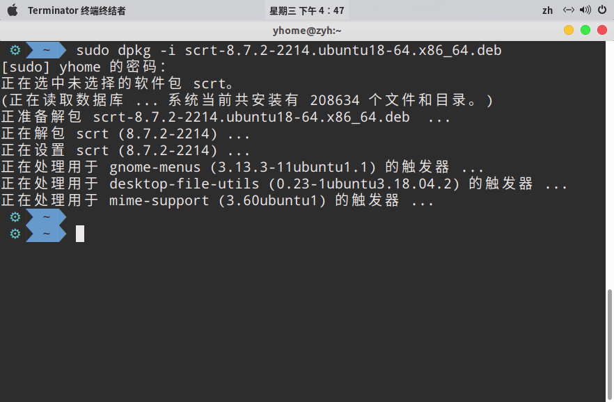
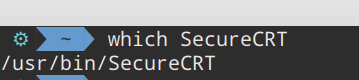
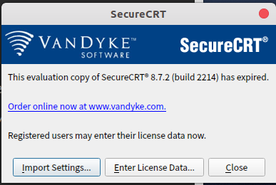
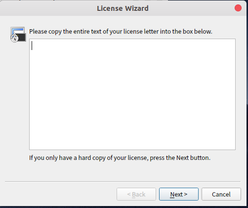
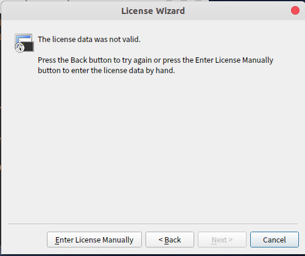
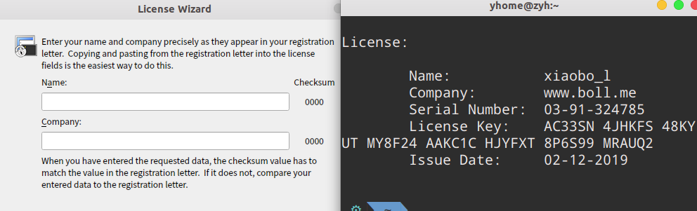

# Ubuntu下Secure CRT安装及破解

#### 资源下载
- [蓝奏网盘 密码: 3t4q ](https://yhome.lanzoux.com/iYR0alrldfc)

#### 安装步骤
##### 方法一 —— 图形界面安装：
　　在Ubuntu下双击安装包，点击安装即安装成功。

##### 方法二 —— 命令行安装：
在终端进入deb包的目录，并输入：
~~~ bash
sudo dpkg -i scrt-8.7.2-2214.ubuntu18-64.x86_64.deb
~~~
输入密码后即完成安装。

#### 破解步骤
Step1. 找到SecureCRT的安装路径，如图，在终端输入以下命令：
~~~bash
which SecureCRT
~~~

根据终端返回的信息可知，Secure CRT的路径在 /usr/bin/SecuerCRT。

Step2. 利用破解文件对软件进行破解，输入以下命令：
~~~bash
sudo perl securecrt_linux_crack.pl /usr/bin/SecureCRT
~~~
~
如上图，破解得到的激活信息已打印在终端上。

Step3. 根据激活信息激活软件:
1. 打开SercureCRT软件;

2. 点击 "Enter License Data..." ;

3. 点击 Next;

4. 点击 Enter License MAnually ;

5. 将终端上的信息逐一复制，粘贴上即可完成激活。
