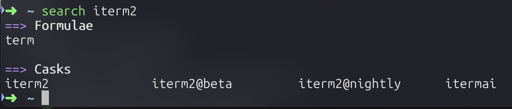
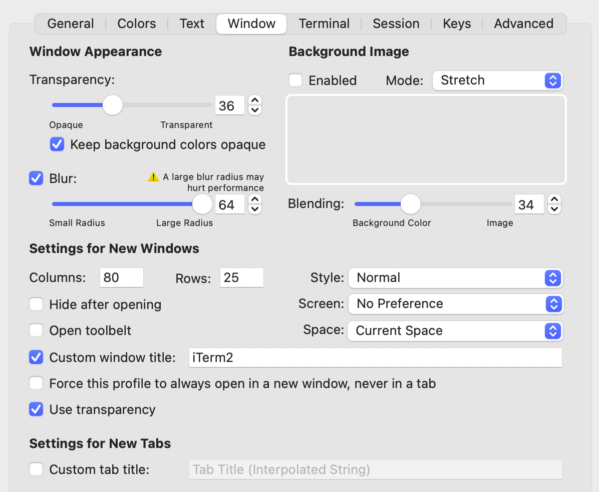
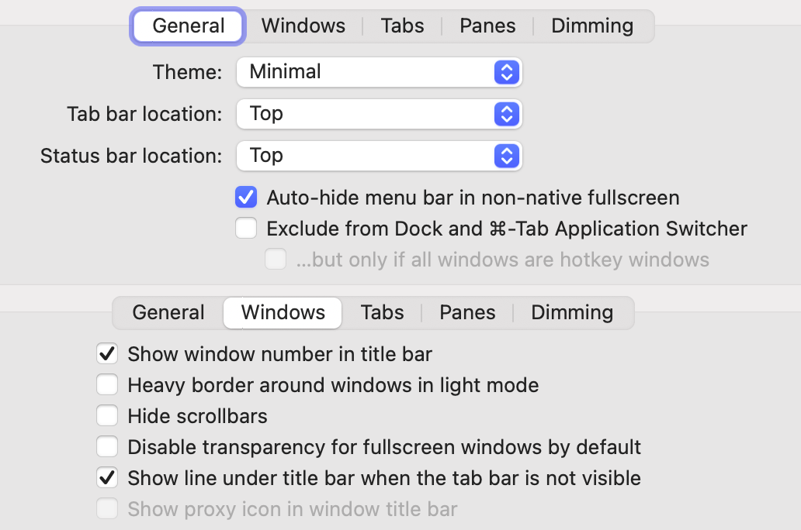
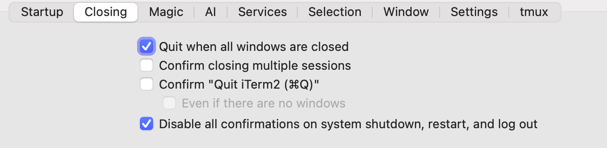
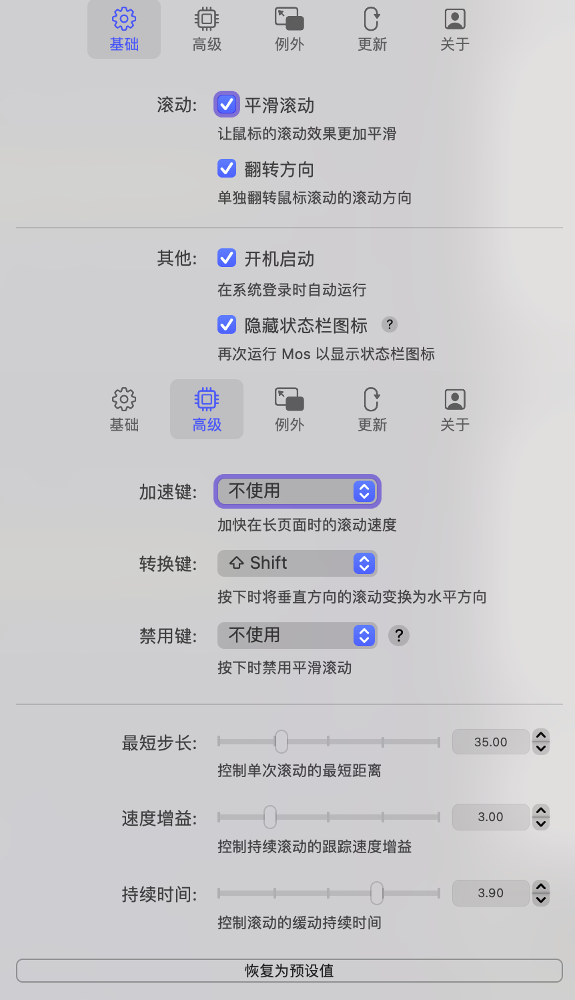
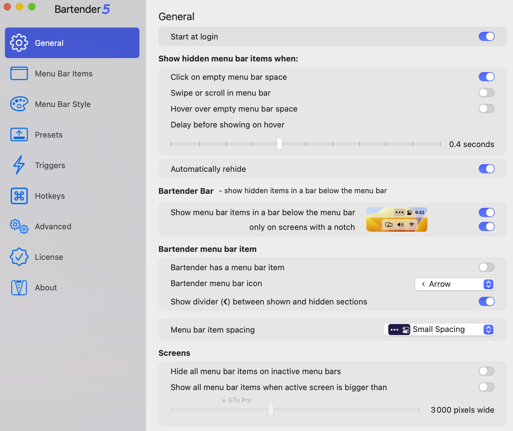
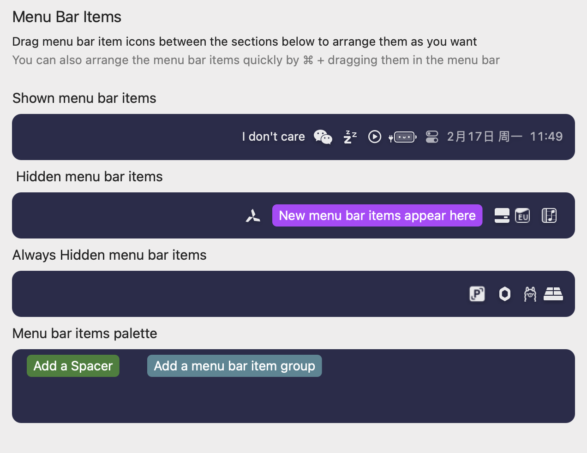
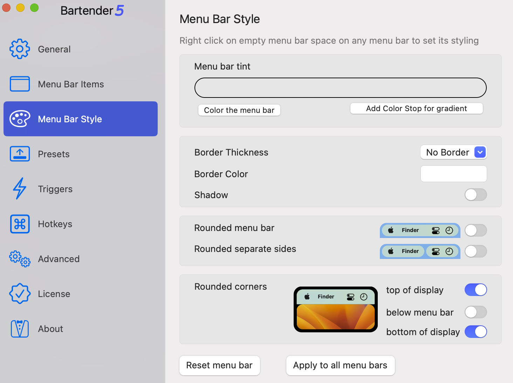
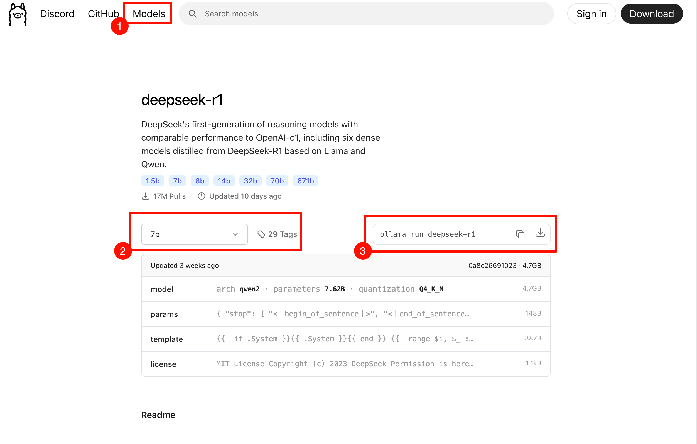
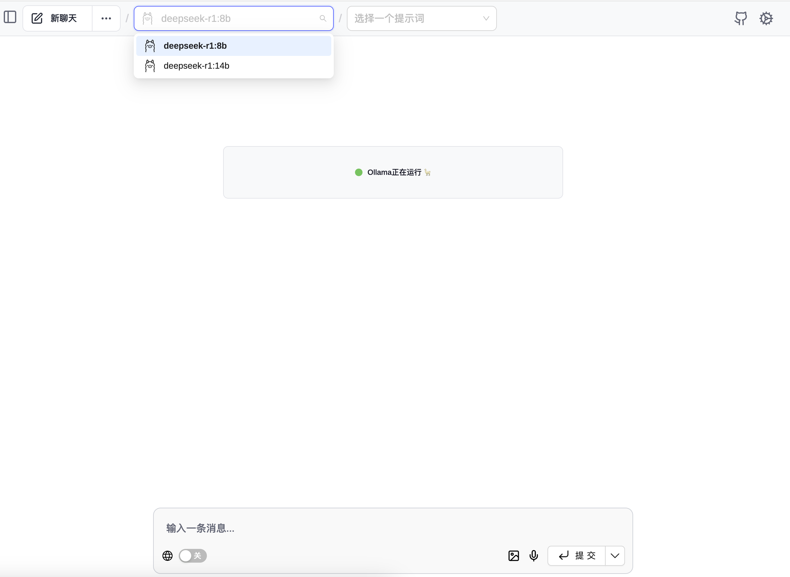

# 深度生产力指南：我的macOS软件栈与系统调优全解析

#### [HomeBrew](https://brew.sh/)
>   macOS的包管理器，类似Ubuntu的apt、Arch的pacman、Redhat的yum

**安装**
> 采用[中科大源](https://mirrors.ustc.edu.cn/help/brew.git.html)

  - 首先在命令行运行如下几条命令设置环境变量：
~~~ bash
export HOMEBREW_BREW_GIT_REMOTE="https://mirrors.ustc.edu.cn/brew.git"
export HOMEBREW_CORE_GIT_REMOTE="https://mirrors.ustc.edu.cn/homebrew-core.git"
export HOMEBREW_BOTTLE_DOMAIN="https://mirrors.ustc.edu.cn/homebrew-bottles"
export HOMEBREW_API_DOMAIN="https://mirrors.ustc.edu.cn/homebrew-bottles/api"
~~~
  - 之后在命令行运行 Homebrew 安装脚本：
~~~bash
/bin/bash -c "$(curl -fsSL https://github.com/Homebrew/install/raw/HEAD/install.sh)"
~~~
> ⭐️初次安装 Homebrew / Linuxbrew 时，如果无法下载安装脚本， 可以使用我们每日同步的安装脚本文件。
> ~~~bash
> /bin/bash -c "$(curl -fsSL https://mirrors.ustc.edu.cn/misc/brew-install.sh)"
> ~~~

**常用指令**

  - 搜索软件: brew search XXX
  - 安装软件: brew install XXX
    - 安装Formulae源: brew install --formulae XXX
    - 安装Cask源: brew install --cask XXX
  - 更新软件列表: brew  update
  - 更新软件: brew upgrade
  - 帮助: brew --help

#### [iTerm2](https://iterm2.com/)
> 自带终端的最强替代软件!!!

**安装**:
~~~bash
brew install --cask iterm2
~~~
**配置**:
- **Colors**: [Dracula Themes](https://draculatheme.com/iterm)
- **Fonts**: [UbuntuSansMono Nerd Font](https://www.nerdfonts.com/font-downloads)
- **Window**
  
- **Appearance**
  
- **Closing**
  

#### Mos
> 自然滚动配置触控板和鼠标是同步的,然而大部分人鼠标和触控板的逻辑是相反的.Mos即可帮忙解决此题。

**安装**
~~~bash
brew install mos
~~~
**配置**

#### Pinpix
> 截图软件,比Snipaste 多了一个贴图OCR功能.

**安装**
~~~bash
brew install pinpix
~~~

#### Maccy
> 剪贴板软件

~~~bash
brew install Maccy
~~~

#### Battry Buddy
> 可爱的顶栏电池图标,虽然不会现在电量百分比,但是他会随着电量的降低,表情逐渐低落.
> 建议把系统电池图标关了.

**安装**
~~~bash
brew install --cask battery-buddy
~~~

#### RunCat
> 菜单栏上圈地养猫,用不同样式的小猫,跑得越快说明系统负荷越重

**安装**
[RunCat - App Store](https://apps.apple.com/cn/app/runcat/id1429033973?mt=12)

#### Keka
> 解压缩软件

~~~bash
brew install keka
~~~

#### Coffee Buzz
> 休眠管理软件,右键可快捷操作

 **安装**:
[Coffee Buzz - App Store](https://apps.apple.com/cn/app/coffee-buzz/id1099454186?mt=12)

#### Bartender 5
> 状态栏管理软件,对比有刘海机型上,状态栏可谓寸土寸金,Bartender便可隐藏不需要一直显示的图标.
> 不过,这是付费软件.

**安装**
[Bartender官网](https://www.macbartender.com/)
<small>(想白嫖那就八仙过海各显神通了😁)</small>
**配置**

#### IconChanger
> 强迫症患者福音,macOS上多数软件图标都是圆角矩形,而然有些图标确实圆形或奇形怪状,IconChanger即可解决此题.

**安装**
~~~bash
brew install --cask iconchanger
~~~
**使用**
软件内有自动联网找图标的功能,但是本人使用是搜索不出来的,可能还需要配置API.我使用的方案是图标网站下载图标,用软件本地替换.
- 推荐一个图标网站:[macOS Icon](https://macosicons.com/#/)

#### 腾讯柠檬
> 系统管家,对标CleanMyMac,屈指可数的良心腾讯应用,免费好用!
> 有商店版(阉割版)和官网版(全量版),通过brew下载的是全量版.

**安装**
~~~bash
brew install --cask tencent-lemon
~~~

#### 爱思助手
> iPhone、iPad刷机、管理工具

**安装**
[爱思助手-官网](https://www.i4.cn/pro_pc.html)

#### ollama
> 本地部署AI大模型

**安装**
[ollama-官网](https://ollama.com/)
**使用**
1、在官网下载页面,点击网页顶部从左到右数的第3️个单词“Models”,即可看到ollama可以部署的所有大模型,选择你想要的大模型,里面会有安装命令.下图以deepseek为例做简要图示.

2、在Chrome里下载插件[Page Assitant](https://chromewebstore.google.com/detail/page-assist-%E6%9C%AC%E5%9C%B0-ai-%E6%A8%A1%E5%9E%8B%E7%9A%84-web/jfgfiigpkhlkbnfnbobbkinehhfdhndo?hl=zh-CN&utm_source=ext_sidebar)
3、在Page Assitant里选择你要使用的模型即可.

备注:下载多少b的模型和你电脑的内存有关系;蒸馏模型肯定没有网页端的全量版好用,我一般使用[360纳米AI](https://bot.n.cn/?src=AIsearch&fr=none)和[硅基流动](https://siliconflow.cn/zh-cn/models)的DS.

#### CherryStudio
> 调用ollama部署的本地DeepSeek,且能支持联网搜索,搭建知识库.

**安装**
~~~bash
brew install --cask cherry-studio
~~~

#### Chrome
**安装**
~~~bash
brew install --cask google-chrome
~~~

#### VS Code
> vscodium是vs Code的开源版本,好比chromium于Chrome

**安装**
~~~bash
brew install --cask visual-studio-code
~~~

#### MonitorControl
> 外接显示器福音,可以直接在系统菜单栏调节外接显示器的亮度

**安装**
~~~bash
brew install --cask monitorcontrol
~~~

**推荐设置**
- 通用: 
  - 启用流畅亮度转换: √
  - 结合软硬件与软件的亮度控制: ×
  - 同步苹果和内置显示器的亮度设置: 看你自己
  - 通过软件或组合调光实现零亮度: ×
  - 启动或唤醒后: 使用上次储存的设置值至显示器
  - 登录时启动: √
  - 自动检查更新: 看你自己
- App选项:
  - 菜单栏图标: 永久置于菜单栏
  - 菜单栏选项样式: 以图标显示
  - 显示亮度控制滑杆: √
  - 苹果和内置的显示器 ×
  - 显示音量滑杆: ×
  - 显示对比度控制滑杆: ×
  - 多个显示器: 显示各个显示器的控制滑杆
  - 用滑杆定位: √
  - 显示滑杆刻度: ×
  - 显示百分比: √
- 键盘:
  - 亮度自定义快捷键: 看你自己
  - 控制的显示器: 取决于鼠标指针的位置
  - 使用精细的OSD刻度: √
  - 使用硬件结合软件调整时忽略软件调整的范围: ×
- 显示器
  - 允许键盘控制显示器: √
  - 使用硬件DDC控制: √
  - 禁用macOS音量OSD: √
  - 避免设置伽马值: √
  - 最底下的 显示高级选项打钩
  - 软硬件控制交接点: 拉到最右边👉🏻

#### LyricX
> 可以在菜单栏和桌面显示歌词,弥补部分软件不能显示状态栏歌词的缺陷.不过很多时候,都会搜错歌词,需要自己手动重新搜索.

**安装**
~~~bash
brew install --cask lyricx
~~~

#### IINA
> 好用的多媒体播放器

**安装**
~~~bash
brew install iina
~~~

#### Easy Move+Resize
> 意如其名,安装指定的快捷键,可以方便的拖动或缩放窗口

**安装**
~~~bash
brew install --cask easy-move+resize
~~~

#### 键指如飞
> 再也不用记快捷键啦!正确使用快捷键后,可以方便地调出当前应用的快捷键.

**安装**
~~~bash
brew install --cask flykey
~~~

#### SoundSource
> 可以像windows7 一样分别调节不用应用的音量
> 需要禁用SIP,介意请忽略.还有这个要钱,平替是Background Music.

**安装**
[SoundSource](https://xclient.info/s/soundsource.html)

#### PictureView
> macOS端能用的看图软件

**安装**
~~~bash
brew install --cask pitureview
~~~

#### skim
> macOS端好用无广的PDF阅读器

**安装**
~~~bash
brew install --cask skim
~~~

#### 格式工厂
> 对,你没有听错,macOS也有格式工厂,而且还上架了App Store!

**安装**
[格式工厂 - App Store](https://apps.apple.com/cn/app/%E6%A0%BC%E5%BC%8F%E5%B7%A5%E5%8E%82/id6443540458?mt=12)

#### macOS小助手
> 类似与windows工具箱的软件

**安装**
[macOS小助手](https://www.appmiu.com/15549.html)

#### VirtualBox
> 优秀知名的跨平台开源虚拟机

**安装**
~~~bash
brew install --cask virtualbox
~~~

#### 米家
> 有米家的同学,可以直接在应用商店下载米家

**安装**
[米家 - App Store](https://apps.apple.com/cn/app/%E7%B1%B3%E5%AE%B6/id957323480)

