# Mac mini M4存储扩容终极指南: 绕过苹果天价SSD

> 最近Mac Mini M4(*下文简称"Mini"*)很火,但是苹果的内存向来是金子做的,大存储配置特别贵. 不少朋友买Mini都是本着性价比去的. 我借着裸辞在家没事干,折腾了一周,给大家分享我的方案.

###### 我的配置
我在拼多多百亿补贴上买的16Gb+256Gb ¥3499
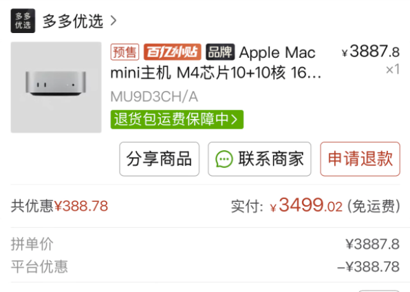

###### 目前流行方案极其利弊分析
1. 原装大容量硬盘
- 优点: 无与伦比的体验
- 缺点: 太贵, 没有性价比, 被认识是智商税
2. 找维修师傅扩容
- 优点: 接近原装方案的体验
- 缺点: 失去保修, 需要重装系统, 运气不好还会碰到各种意想不到的问题,比较考验师傅的技术
3. 外接雷雳4硬盘 + 直接安装系统到外接硬盘上 (我试过,踩坑)
- 优点: 不用拆机, 几乎没有人工费用, 代价最小
- 缺点: 当你重装系统到外接硬盘上之后,你有两个选择:
  - **不格式化机身硬盘** --- 机身硬盘的空间被浪费了,因为你长时间都是使用外接硬盘的系统,即便有多用户使用场景,系统也有多用户功能,不需要切换到机身硬盘的系统;
  - **格式化机身硬盘** --- 有很多App需要禁用SIP或降级SIP安全性才能使用,比如NTFS for Mac, Sound Source 等等. 这个时候你进去恢复模式打算操作,就会发现给你弹出类似"没有找到管理员用户"的提示. 然而,在这个时候,你费尽周章地Google到要回到系统再新建一个用户就能禁用,如果真的这么做了,那一定会不出意外的发现,没有卵用!
> 用户目录是什么,有什么用? 我们的大部分文件和数据,都是存在用户目录的,Windows系统也有转移"下载","桌面","图片"等文件夹到其他硬盘的操作. 我们现在也是一样的逻辑,把大部分的存储任务分担给外接硬盘,即可解决存储焦虑.
> 
> 这个事情没有这么简单,我们要从原理上来分析: macOS是属于类Unix,和Linux也有不少相似的地方. 懂Linux的人一定知道,Linux新建完用户之后,会在/home/下面创建一个用户目录. macOS"的home目录"叫/Users/,同样的,你电脑上的用户文件夹也在这里. 
>

      - 我们可以在恢复模式打开终端,进入Users目录,会发现没有你外接硬盘系统的用户. 因为我们外接硬盘的用户是在/Volumes/"外接硬盘"/Users/内. 也就是说,我们恢复模式下的系统根目录还是基于机身硬盘来的. 我尝试过把/Volumes/"外接硬盘"/Users/的文件复制到/Users/ ,或者是软链接,都没有用. 且macOS也没有类似于archlinux的chroot指令,直接进入其他硬盘的系统. 所以这种方案禁用SIP是无解的.
1. 我的方案 --- 雷雳4硬盘 + 迁移用户目录
- 优点: 免拆机,免刷机,原装系统,默认支持的功能,多硬盘电脑Linux系统装机逻辑
- 缺点: 一直外接硬盘不太美观

##### 操作过程:
1. 准备一个NVMe固态硬盘 和 雷雳4硬盘盒(40Gbps), 并组装好, 插入Mini;
   - 市面上用很多带硬盘位的拓展坞速率只有10Gbps,别买这种,**慢了4倍**!
   - 雷雳4的传输速率为40Gbps=5000MB/s , NVMe硬盘的传输速率建议不要低于5000MB/s
   - 一定注意: Mini只有背面的typeC接口能达到40Gbps !
    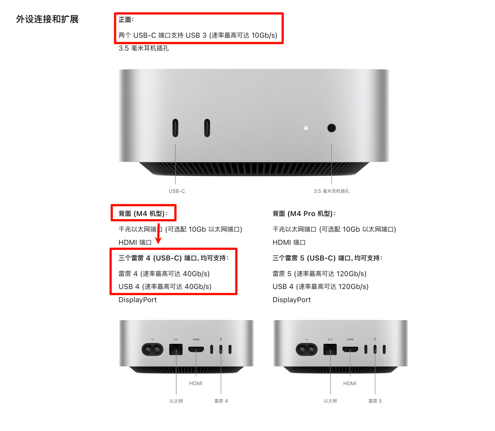
2. 打开自带的磁盘工具App, 将外接硬盘抹掉,格式化为APFS;
    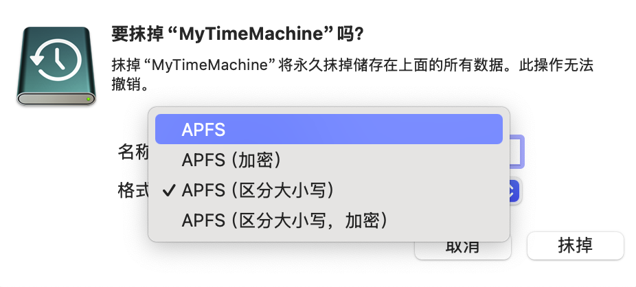
   - 至于区不区分大小写,我也不太清楚,我的系统盘选了"区分大小写"后,Steam和Epic运行不了
   - 不建议加密,后面出了啥问题很难搞的
   - 你可以看到,连接类型是显示的PCIe,这和PC机的NVMe硬盘类型是一样的.
    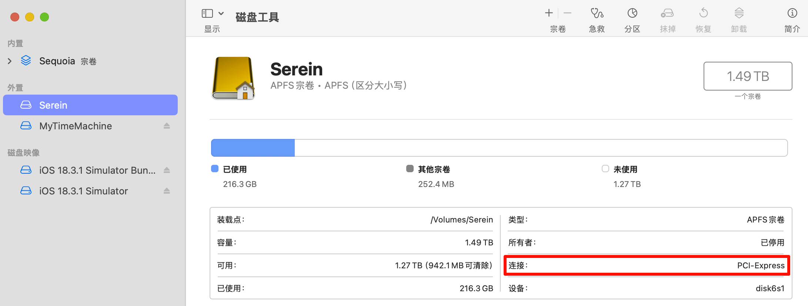
   - 如果你的外接硬盘空间足够大,可以分成两个盘,一个做User目录,一个做时间机器.
3. 打开设置App,点击"用户与组群",在你的用户上**右键**,会显示出"高级选项...",我们点进去;
    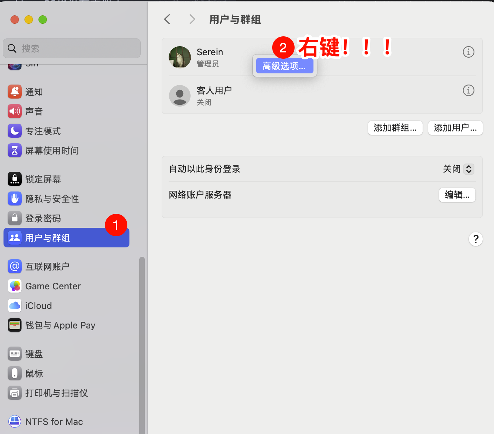
4. 只需要将"个人目录"改成外接硬盘的路径即可,一定要一次改对!
    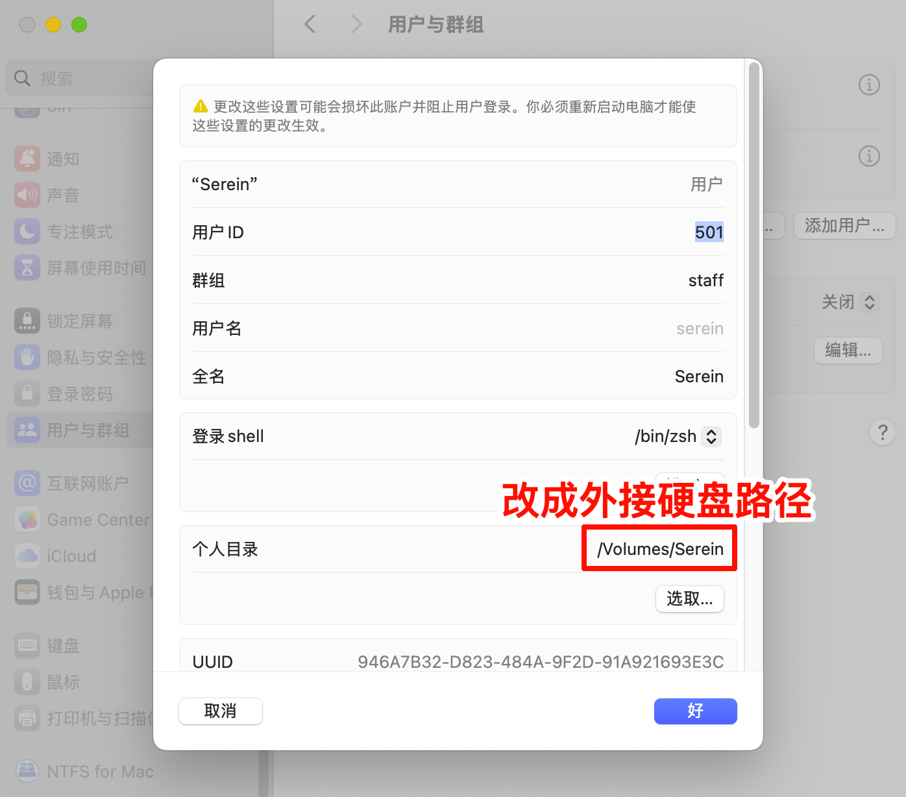
   - 外接硬盘路径怎么查? 一般外接硬盘的路径挂载在 /Volumes/ 下
   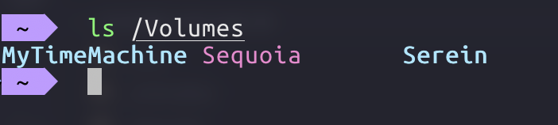
   - 如果用户目录是在 外接硬盘下的 home目录里面, 那么你个人目录要改成 /Volumes/"外接硬盘名"/home/ 才是正确的
   - 改完之后记得重启电脑.
5. 更改软件安装位置
   - App Stroe: 直接在App Stroe的设置中更改;
    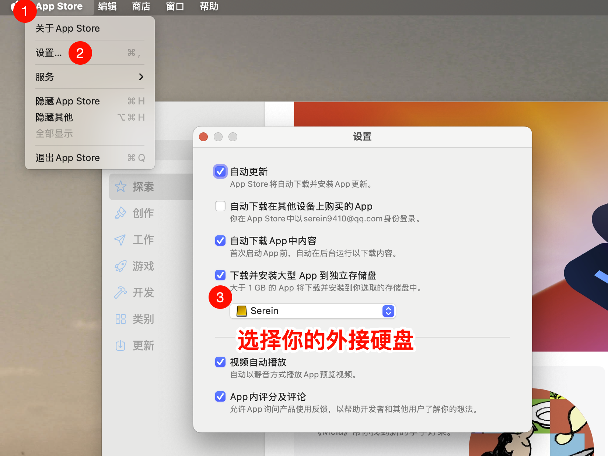
   - HomeBrew: 
      - 比如说我在外接硬盘用户目录新建一个目录专门存放app,取名叫 App . 那么就把/opt/homebrew/ 移动到App目录下.
        ~~~ bash
        sudo mv /opt/homebrew/ /Volumes/替换你用户名/App/
        ~~~
       - 然后使用软链接,将App下的homebrew链接到/opt/即可.
        ~~~ bash
        # 一定要使用绝对路径!
        sudo ln -s /Volumes/替换你用户名/App/homebrew/ /opt/
        ~~~
       - 给大家看一下我的软链接
        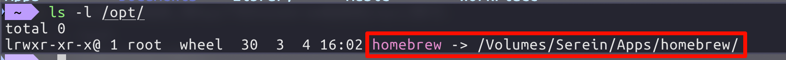
6. 迁移其他软件的安装位置,如照片,iCloud等等;
7. 坊达建议设置
    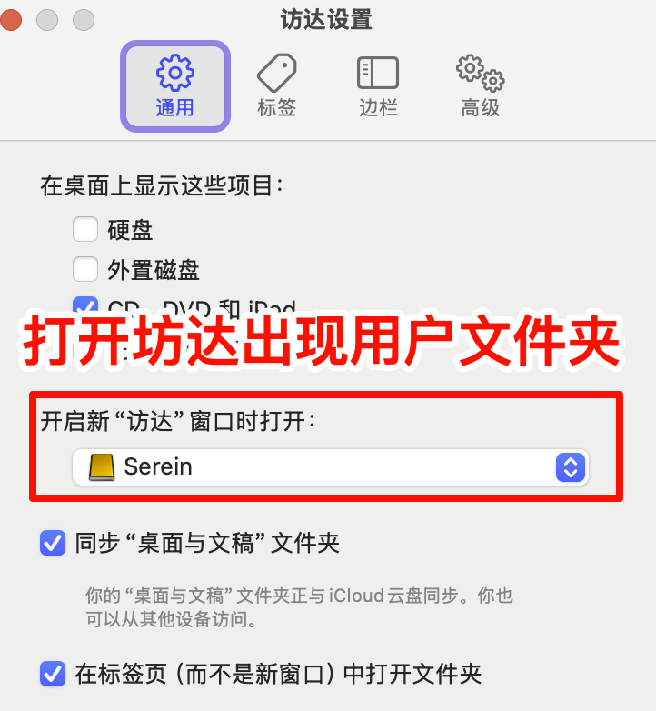
    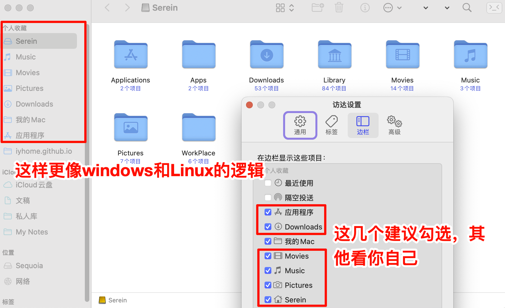
8. 如此一来,大部分的文件和软件都会存储在外接硬盘上了.
   - 安装pkg和dmg软件的时候,如crossover,如果提示全局安装还是用户安装,选用户安装就会安装在外接硬盘,选全局安装就会安装在机身硬盘.

###### 成果展示
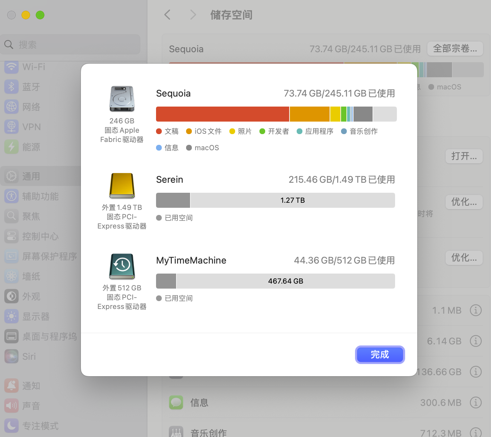

