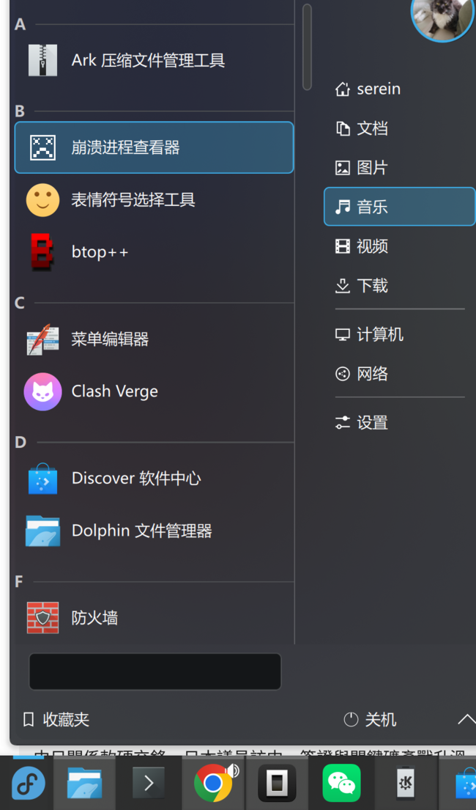
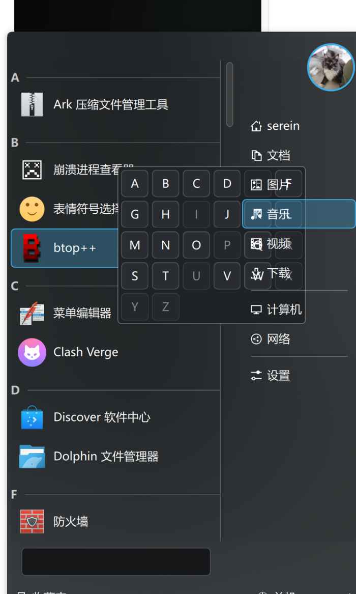
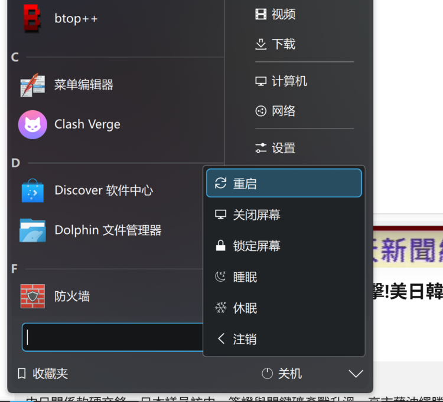

# 把 Windows 7 开始菜单搬到 Plasma 6：扁平化、中文化、Win10 式首字母分组


KDE Store 上有一个还原度很高的 **Windows 7 开始菜单** plasmoid：`Windows7StartMenu4KDE`。它左右双栏、有跳转列表、有电源菜单，唯独「所有程序」还是按分类文件夹展开的。我不喜欢文件夹，想要 Windows 10 那种平铺 + 首字母分组，顺便全中文。于是 fork 出来改了一版。

仓库：<https://github.com/iyhome/Win7StartMenu-CN>（插件 ID `win7startmenu-cn`）


## 1. 改名：翻译域跟着插件 ID 走

fork 之后第一件事是改名。KDE plasmoid 的翻译域是 `plasma_applet_<插件ID>`，所以改 ID 必须同步重命名所有 `.mo`：

```
contents/locale/<locale>/LC_MESSAGES/plasma_applet_<id>.mo
```

`metadata.json` 的 `KPlugin.Id`、`metadata.desktop` 的 `X-KDE-PluginInfo-Name`、目录名、翻译文件名要一起改，否则译文不生效。

## 2. 扁平化「所有程序」

原项目用 `Kicker.RootModel` 的 `hierarchicalAllPrograms` 在「分类树」和「平铺列表」之间切换。我直接把它固定成平铺：

```qml
readonly property bool hierarchical: false
```

并移除设置里的分类选项。`RootModel` 侧对应 `sorted: true`、`showTopLevelItems: false`、`showAllApps: true`。

## 3. 中文翻译

新建 `translate/zh_CN.po`，编译成 `.mo`。没有 `msgfmt` 的环境可以用 Python 直接写 MO（MO 格式很简单），注意**复数条目**的 msgid 在 MO 里是 `单数\0复数` 的形式，翻译串是各复数形式用 `\0` 连接——这个坑不踩一次很难发现。

## 4. 菜单宽度之谜：配置覆盖了 QML

想收窄菜单，改了 `fullRepresentation` 的 `Layout.preferredWidth`，结果**毫无变化**。排查后发现：applet 配置里存着 `popupWidth`/`popupHeight`，会覆盖 QML 的尺寸。

```
~/.config/plasma-org.kde.plasma.desktop-appletsrc
[Containments][2][Applets][34][Configuration]
popupWidth=432
popupHeight=649
```

清掉这两行后 QML 的 `preferredWidth` 才生效；之后 Plasma 会把当前尺寸再写回去。最终宽度定在 22 个 `gridUnit`。

## 5. Win10 式首字母分组

用 `ListView` 的 section 机制最省事：

```qml
ListView {
    model: groupedModel           // 每行带一个 section 角色
    section.property: "section"
    section.criteria: ViewSection.FullString
    section.delegate: PlasmaExtras.ListSectionHeader {
        required property string section
        width: listView.width
        label: section
    }
}
```

`PlasmaExtras.ListSectionHeader` 自带「字母 + 横线」的样式，正好是 Win10 那种。模型侧把 app 列表按首字母算出 `section` 再塞进一个 `ListModel`，并排序保证同一 section 连续（否则标题会重复出现）。



## 6. 中文名按拼音分组

中文应用名如果只取首字，会全掉进 `#`。要按拼音首字母，就得有「汉字 → 拼音」的表。系统里正好装了 rime，`cn_dicts/8105.dict.yaml`（通用规范汉字表，8757 字，含拼音）可以直接生成映射：

```python
# 取每个字权重最高的读音，首字母归到 A-Z
best[ch] = (weight, pinyin[0].upper())
```

生成 `code/pinyin.js`（约 48KB），按首字母把汉字存成 26 个字符串，运行时建反查表。于是「崩溃→B」「菜单→C」「防火墙→F」都能正确归类。

## 7. 字母索引：不能用 Popup

想要 Win10 那样「点标题 → 弹出 26 个字母 → 点字母跳转」。第一版用 `QtQuick.Controls` 的 `Popup`，结果一弹出来**整个开始菜单就关了**——因为独立弹窗让 applet popup 失焦，Plasma 就把它收起来了。

改成菜单**内部**的浮层（一个 `Item` + 半透明遮罩 + 网格按钮），完全不碰焦点：

```qml
function jumpToSection(letter) {
    const index = view.sectionStart[letter];
    listView.currentIndex = index;
    listView.positionViewAtIndex(index, ListView.Beginning);
}
```



## 8. 图标发虚的两个坑

**其一，半像素坐标。** 分组标题高度带小数，导致下面的条目落在非整数坐标，图标被半像素重采样而发虚。把标题高度 `Math.round()` 取整、图标用整数坐标即可。

**其二，图标尺寸要匹配主题真实尺寸。** 「所有程序」按钮原本用 `applications-all-symbolic`，但 Breeze 里这个图标只有 22/24/32px、没有 16px；按钮按 16px 请求时被缩小，就发虚。把按钮图标尺寸设为 `smallMedium`（22px）后立刻清晰。顺带把电源菜单的「关闭屏幕」从彩色的 `video-display` 换成 `monitor-symbolic`，并给所有电源图标加 `isMask: true` 统一成单色。



## 9. 小结

| 改动 | 关键点 |
|---|---|
| 改名 | 翻译域 `plasma_applet_<id>` 必须同步改 `.mo` |
| 扁平化 | `RootModel` 固定 `hierarchical=false` |
| 中文化 | `zh_CN.po` → `.mo`（注意复数 `\0` 格式） |
| 收窄 | applet 配置的 `popupWidth` 会覆盖 QML |
| 首字母分组 | `ListView.section` + `PlasmaExtras.ListSectionHeader` |
| 拼音分组 | 从 rime 8105 字典生成汉字→首字母表 |
| 字母索引 | 用菜单内浮层，别用 Popup（会关菜单） |
| 图标清晰 | 整数坐标 + 匹配主题图标尺寸 |

一句话：**KDE plasmoid 的坑，一半在 QML，一半在它背后的配置与翻译体系。** 把 QML 写对只是开始，还得跟 `popupWidth`、翻译域、图标主题尺寸这些「看不见的约定」打交道。

